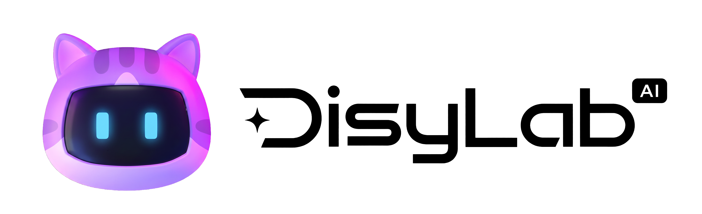

<p align="center">
  <picture>
    <source media="(prefers-color-scheme: dark)" srcset="docs/assets/logo-black.png" />
    <source media="(prefers-color-scheme: light)" srcset="docs/assets/logo-white.png" />
    
  </picture>
</p>

<h1 align="center">DisyLab</h1>

<p align="center">
  <a href="README.md">简体中文</a> · <a href="README.zh-TW.md">繁體中文</a> · English
</p>

<p align="center">
  <strong>Keep characters, references, prompts, and every creative attempt on one canvas that grows with your work.</strong>
</p>

<p align="center">
  A local-first AI infinite canvas for designers, commerce creatives, and content creators.
</p>

<p align="center">
  <a href="https://disylab.pages.dev">Live App</a> ·
  <a href="https://tyaash.github.io/DisyLab-Canvas/">Project Site</a> ·
  <a href="#quick-start">Quick Start</a> ·
  <a href="#roadmap">Roadmap</a>
</p>

<p align="center">
  
  
  
  
</p>

> [!IMPORTANT]
> **DisyLab is proprietary source-available software, not open-source software.** Commercial use, sale, rental, white-labeling, redistribution, relicensing, and paid services based on this project or modified versions require prior written permission from the copyright holder. See [LICENSE](LICENSE) and [COMMERCIAL-LICENSE.md](COMMERCIAL-LICENSE.md).

## What's new in v1.0.4

- **Workflow system:** a searchable and categorized template library, smooth motion, canvas import, and reusable node flows.
- **Complete video workflow:** text-to-video, image-to-video, first/last frame, image reference, and all-reference modes with model-aware parameters.
- **Video editing:** a compact trim desk, nine-grid crop, current/first/last-frame capture, fullscreen preview, downloads, and video asset management.
- **Video plans in Agent:** review a proposed video direction before creating nodes and running generation; project style presets can inform compatible reference-image modes.
- **iOS 26-inspired glass UI:** readable frosted-glass nodes, editors, floating toolbars, menus, and dialogs, with corrected layering and Escape-key behavior.
- **Multi-platform deployment relay:** APIYI video task submission, polling, and media relay endpoints for Cloudflare Pages, Netlify, and Vercel.

## Core capabilities

- Infinite canvas, node connections, and multi-canvas projects.
- Text, upload, image, video, and Agent nodes.
- Image generation, video generation, trimming, cropping, and frame capture.
- Workflow templates, inspiration library, asset library, and generation history.
- Local-first storage with `.disy` project import and export.
- API keys are stored separately and are not embedded in exported project packages.

## Quick start

Node.js 22.12 or newer is required.

```bash
npm install
npm run dev
```

Production checks:

```bash
npm run typecheck
npm run build
```

## Roadmap

- **3D previsualization stage:** preview shots, scenes, character blocking, and spatial relationships before generation.
- **Skill integration:** connect reusable specialist capabilities to Agent and structured creative workflows.
- **Languages and themes:** additional interface languages plus dark and light modes will roll out progressively.
- **Platform engineering:** frontend/backend separation and a desktop app are in active development.

## License

Copyright © 2026 Ash / Tya. All rights reserved. See [LICENSE](LICENSE), [LICENSE.zh-CN.md](LICENSE.zh-CN.md), and [COMMERCIAL-LICENSE.md](COMMERCIAL-LICENSE.md).
